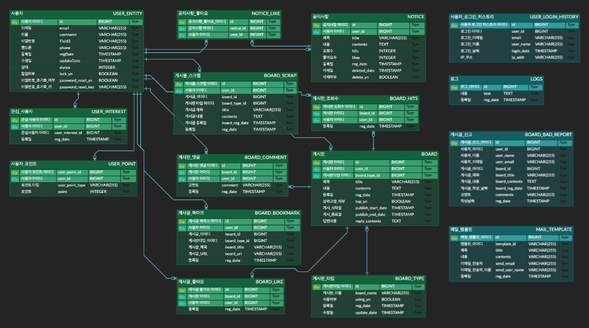

# Example100

---
> 스프링부트를 이용해서 100가지의 기능및 문제를 구현해보는 프로젝트입니다.

## 1. 기능목록
1. "/first-url"을 주소로 가지는 반환값이 없는 주소를 작성하시오.
2. "Hello World!" 문자열을 반환하는 주소를 작성하시오.
3. "hello spring" 문자열을 반환하는 api를 작성하시오.
4. GetMapping 어노테이션을 사용하여 "hello rest" 문자열을 반환하는 Rest형식의 함수를 작성하시오.
5. GetMapping 어노테이션을 사용하여 "hello rest api" 문자열을 반환하는 Rest형식의 함수를 작성하시오.
6. "공지사항입니다." 문구를 리턴하는 api를 작성하시오.
7. 공지사항 게시판의 내용을 추상화한 모델(게시글ID, 제목, 내용, 등록일)이며 데이터는 (게시글 ID = 1, 제목 = 공지사항입니다, 내용 = 공지사항 내용입니다, 등록일 = 2021-01-31) 리턴
8. 공지사항 게시판의 내용을 추상화한 모델을 복수형태로 리턴하는 api를 작성하시오.
9. 빈 공지사항 데이터 리스트를 반환하는 api를 작성하시오.
10. 공지사항 게시판의 목록중 전체 개수 정보에 대한 요청을 처리하는 api를 작성하시오.
11. 공지사항에 글을 등록하기 위한 api를 작성하시오.
    - 파라미터는 추상화한 모델을 사용x
12. 공지사항에 글을 등록하기 위한 api를 작성하시오.
    - 파라미터를 추상화한 모델로 입력
13. 공지사항에 글을 등록하기 위한 api를 작성하시오.
    - application/json 형태로 입력.
14. 데이터베이스에 공지사항을 등록하는 api를 작성하시오.
    - h2 데이터베이스 사용, id값을 포함한 엔티티 리턴
15. 공지사항을 등록한는 api를 작성하시오.
    - 공지사항 조회수와 좋아요수의 초기값은 0으로 저장
16. 공지사항 글을 수정하기 위해 상세정보를 요청하는 api를 작성하시오.
    - 요청주소의 공지사항 ID는 동적으로 변하게 지정, 공지사항이 존재하지 않을 경우 null을 리턴
17. 공지사항 글을 수정하기 위한 api를 작성하시오.
    - 수정일은 현재시간을 저장, 조회수와 좋아요수는 변경x. 
18. 공지사항 글을 수정하기 위한 api를 작성하시오.
    - 게시글이 존재하지 않을 경우 Exception을 발생시킨다.
    - ExceptionHandler를 통해 구현하고 발생하는 예외에 대해서는 400에러, 예외 메시지를 리턴)
19. 공지사항 글을 수정하기 위한 api를 작성하시오.
    - 존재하지 않는 게시글일경우 예외 발생.
    - 제목, 내용, 수정일 수정.
20. 공지사항의 조회수를 증가시키는 api를 작성하시오.
21. 공지사항을 삭제하기 위한 api를 작성하시오.
22. 공지사항을 삭제하기 위한 api를 작성하시오.
    - 공지사항이 존재하지 않을 경우 예외를 발생하시오.
23. 공지사항을 삭제하기 위한 api를 작성하시오.
    - 공지사항 글을 물리적으로 삭제하지 않고 삭제 플래그값을 이용하여 삭제.
    - 삭제시간은 현재시간으로 설정.
    - 공지사항이 이미 삭제된 경우에는 200 코드와 "이미 삭제된 글입니다." 문구를 리턴.
24. 여러개의 공지사항을 삭제하기 위한 api를 작성하시오.
    - 삭제할 공지사항의 id값들을 추상화한 모델로 입력.
    - application/json 형태로 입력.
25. 모든 공지사항 데이터를 삭제하기 위한 api를 작성하시오.
26. 공지사항을 등록하는 api를 작성하시오.
    - 이슈 : data.sql로 id값을 직접추가해준다면 JPA를 이용해서 데이터를 추가할 때 id값이 1부터 시작해 중복될 수 있음.
    - 해결 : data.sql 파일에서 id값을 지정하지 않는다.
27. 공지사항을 등록하는 api를 작성하시오.
    - 제목과 내용이 입력되지 않은 경우 400리턴.
    - 예외발생시 에러를 취합하여 콜렉션형태로 리턴.
28. 공지사항을 등록할때 입력값에 대해 검사하고 등록하는 api를 작성하시오.
    - 제목의 경우 10~100자 사이.
    - 내용의 경우 50~1000자 사이.
29. 데이터베이스에서 파라미터로 전달된 개수만큼 최근 공지사항을 리턴하는 api를 작성하시오.
30. 공지사항을 등록한 이후에 바로 동일한 제목과 내용의 공지사항을 등록하는 경우 등록을 막는 api를 작성하시오.
    - 제목, 내용 일치 및 등록일간의 차이가 1분이내일경우 중복으로 판단.
31. 사용자 등록시 입력값이 유효하지 않은 경우 예외를 발생시키는 기능을 작성하시오.
    * 입력값 : 이메일(ID), 이름, 비밀번호 연락처
    * 사용자 정의 에러 모델을 이용하여 에러를 리턴.
32. 사용자 정보를 입력받아서 저장하는 api를 작성하시오.
    * 입력값 : 이메일(중복확인), 이름, 비밀번호, 연락처, 가입일(현재일)
33. 사용자 정보를 수정하는 api를 작성하시오.
    * 사용자 정보가 없는 경우 UserNotFoundException 발생.
    * 연락처만 수정가능, 수정일은 현재 시간.
34. 사용자 정보를 조회의 기능을 수행하는 api를 작성하시오.
    * 비밀번호, 가입일, 회원정보 수정일은 리턴x
35. 본인이 작성한 공지사항 목록을 제공하는 api를 작성하시오.
    * 삭제일, 삭제자 아이디는 제공x.
    * 작성자정보를 모두 제공하지 않고, 아이디와 이름만 제공.
36. 사용자 등록시 이미 존재하는 이메일인경우 예외를 발생시키는 api를 작성하시오.
    * 동일한 이메일에 가입된 회원정보가 존재하는 경우 UserAlreadyExistsException 에외 발생.
37. 사용자의 비밀번호 수정 기능을 제공하는 api를 작성하시오.
    * 기존 비밀번호와 일치할경우 수정. 일치하지 않을 경우 PasswordNotMatchException 예외 발생.
38. 회원가입시 비밀번호를 암호화하여 저장하는 api를 작성하시오.
39. 사용자 회원 탈퇴 기능에 대한 api를 작성하시오.
    * 회원정보가 존재하지 않은 경우 예외처리
    * 사용자가 등록한 공지사항이 있을 경우 회원삭제가 되지 않음.
40. 사용자 아이디(이메일)를 찾는 api를 작성하시오.
    * 이름과 전화번호에 해당하는 이메일을 찾는다.
41. 사용자 비밀번호 초기화 요청(아이디 입력후 전화번호로 문자를 전송받음)의 기능을 수행하는 api를 작성하시오.
    * 아이디에 대한 정보 조회후 비밀번호를 초기화한 이후에 이를 문자전송.
    * 초기화 코드는 10자의 문자열로 지정.
42. 사용자가 좋아요한 공지사항 목록을 제공하는 api를 작성하시오.
43. 사용자 이메일과 비밀번호를 통해서 가입된 회원정보와 일치하는지 확인(로그인)하는 api를 작성하시오.
    * 비밀번호가 일치하지 않은 경우 PasswordNotMatchException 발생.
44. 사용자의 이메일과 비밀번호를 이용해서 JWT 토큰을 발행하는 api를 작성하시오.
45. JWT 토큰 발행시 발행 유효기간을 1개월로 저장하는 api를 작성하시오.
46. JWT 토큰을 재발행하는 api를 작성하시오.
    * 이미 발행된 JWT토큰을 통해서 토큰을 재발행하는 로직 구현.
    * 정상적인 회원에대해서 재발행 진행.
47. JWT 토큰에 대한 삭제를 요청하는 api를 작성하시오.
48. 사용자 목록과 사용자 수를 함께 내리는 api를 작성하시오.
    * {"totalCount": 3, "data": ...} 의 형식으로 리턴.
49. 사용자의 상세 정보를 조회하는 api를 조건에 맞게 구현하시오.
    * {"header": {result: true|false, resultCode:String, message: error message or alert message, status: http result code}, "body": data}
50. 사용자 목록 조회에 대한 검색을 리턴하는 api를 작성하시오.
    * 이메일, 이름, 전화번호에 대한 결과를 리턴.
51. 사용자의 상태를 변경하는 api를 작성하시오.
    * 정상 : Using, 정지 : Stop
52. 사용자 정보를 삭제하는 api를 작성하시오.
    * 작성된 게시글이 있을 경우 예외처리.
53. 사용자가 로그인했을 때 접속이력이 저장된다고 했을 때, 접속이력을 조회하는 api를 작성하시오.
    * UserLoginHistory 엔티티를 통해서 구현
54. 사용자의 접속을 제한하는 api를 작성하시오.
55. 사용자의 접속제한을 해제하는 api를 작성하시오.
56. 회원전체수와 상태별 회원수에 대한 정보를 리턴하는 api를 작성하시오.
    * 서비스 클래스를 이용해서 작성.
57. 오늘 가입한 사용자 가입 목륵을 리턴하는 api를 작성하시오.
58. 사용자별 공지사항 게시글수를 리턴하는 api를 작성하시오.
59. 사용자별 공지사항수와 좋아요수를 리턴하는 api를 작성하시오.
60. 좋아요를 가장 많이 한 사용자 목록(10개)을 리턴하는 api를 작성하시오.
61. 게시판 타입을 추가하는 api를 작성하시오.
    * 동일한 게시판 제목이 있는 경우 status=200, result=false, message에 이미 존재하는 게시판이 있다고 리턴.
    * 게시판 이름은 필수항목에 대한 부분 체크
62. 게시판 타입을 수정하는 api를 작성하시오.
63. 게시판 타입을 삭제하는 api를 작성하시오.
    * 삭제할 게시판 타입의 게시판이 존재하면 삭제 진행 불가 처리.
64. 게시판 타입의 목록을 리턴하는 api를 작성하시오.
65. 게시판 타입의 사용여부를 설정하는 api를 작성하시오.
66. 게시판별 작성된 게시글의 개수를 리턴하는 api를 작성하시오.
    * 현재 사용가능한 게시판에 대해서 게시글의 개수를 리턴.
67. 게시글을 최상단에 배치하는 api를 작성하시오.
68. 최상단에 위차한 게시글을 최상단 배치를 해제하는 api를 작성하시오.
69. 게시글의 게시기간을 시작일과 종요일로 설정하는 api를 작성하시오.
70. 게시글의 조회수를 증가시키는 api를 작성하시오.
    * 동일 사용자에 의한 게시글 조회수 증가를 방지하는 로직 포함.
    * JWT 인증을 통과한 사용자에 대해서 진행.
71. 게시글에 대한 좋아요하기 기능을 수행하는 api를 작성하시오.
72. 게시글에 좋아요를 취소하는 api를 작성하시오.
73. 게시판을 신고하는 기능의 api를 작성하시오.
74. 게시글의 신고 목록을 조회하는 api를 작성하시오.
75. 게시글의 스크랩을 추가하는 api를 작성하시오.
76. 게시글의 스크랩을 삭제하는 api를 작성하시오.
77. 게시글의 북마크를 추가/삭제하는 api를 작성하시오.
78. 관심사용자에 등록하는 api를 작성하시오.
79. 관심사용자를 삭제하는 api를 작성하시오.
80. 내가 작성한 게시글 목록을 리턴하는 api를 작성하시오.
81. 내가 작성한 게시글의 코멘트 목록을 리턴하는 api를 작성하시오.
82. 사용자의 포인트 정보를 만들고 게시글을 작성할 경우 포인트를 누적하는 api를 작성하시오.
83. 회원로그인 히스토리 기능을 구현하시오.
84. 로그인시 에러가 발생하는 경우 로그에 기록하는 기능 작성
85. AOP의 Around를 이용하여 게시판 상세 조회에 대한 히스토리를 기록하는 기능을 작성하시오.
86. RestTemplate을 이용한 공공데이터포털의 api를 연동하여 전국약국목록을 가져오는 api를 작성하시오.
    * 결과값을 단순 문자열로 반환.
87. 전국약국목록 검색 결과를 모델로 매핑하여 리턴하는 api를 작성하시오.
88. 전국약국목록 검색 결과를 모델로 매핑하여 리턴하는 api를 작성하시오.
    * 시도/구군 단위로 검색 기능 추가.
89. 미세먼지 정보 조회 api를 사용하여 결과를 반환하는 api 작성하시오.
    * xml -> Java Object XmlMapper 사용하기
90. ~~카카오 api 활용(x)~~
91. naver open api를 이용하여 번역 api 작성하시오.
92. 인터셉터를 이용하여 API 요청에 대한 정보를 LOG에 기록하는 기능을 작성하시오.
93. 인터셉터를 활용하여 JWT 인증이 필요한 API에 대해서 토큰 유효성을 검증하는 API를 작성하시오.
94. applicationl.yml파일에 작성한 프로퍼티 내용들을 프로퍼티 클래스로 분리하시오.
95. 회원가입을 시도한 사용자에게 이메일을 전송하는 api를 작성하시오.
96. 비밀번호 초기화시 사용자에게 인증코드를 전송하는 api를 작성하시오.
97. 게시판 작성을 완료하면 사용자에게 작성완료 메일을 전송하는 API를 작성하시오.
98. 문의 게시판에 답변을 달경우 메일을 전송하는 API를 작성하시오.
99. 스프링 스케줄러를 이용하여 매일 새벽 4시에 로그정보를 삭제하는 기능을 작성하시오.
100. 스프링 스케줄러를 이용하여 회원중 가입일이 1년이 도래한 회원들에 대해서 서비스 이용내역 통지 메일을 보내는 기능을 작성하시오.


## 2. 프로젝트 구조


## 3. yml파일 설정
- h2 데이터베이스 설정 1
```yaml
spring:
  h2:
    console:
      enabled: true
      path: /h2-console

  # h2의존성을 runtimeOnly로 설정해야 드라이버 사용가능
  datasource:
    url: jdbc:h2:mem:backOfficeDb
    driver-class-name: org.h2.Driver
    username: root
    password: '1111'

  jpa:
    hibernate:
      ddl-auto: create-drop
    show-sql: true
    generate-ddl: true
```
- h2 데이터베이스 설정 2 (data.sql을 통해 데이터를 미리 삽입하는 경우)   
ddl-auto 옵션을 'none'으로, generate-ddl 옵션을 false로 지정.   
프로젝트를 시작할 때 자동으로 data.sql 쿼리문을 실행해 데이터가 삽입된다.
```yaml
spring:
  # 생략
  jpa:
    hibernate:
      ddl-auto: none
    show-sql: true
    generate-ddl: false
```
- stmp 설정
```yaml
spring:
  mail:
    username: {이메일주소}
    password: {gmail 인증번호}
    host: smtp.gmail.com
    port: 587
    properties:
      mail:
        smtp:
          auth: true
          starttls:
            enable: true
```
## 4. 이슈
### 1. h2 데이터베이스 이슈
data.sql 파일을 이용해서 h2 데이터베이스에 데이터를 직접 넣은 상태에서 
JPA를 이용해 save 메소드로 데이터를 추가하게 될경우 id값이 중복되는 이슈가
생긴다.
### 해결방법
data.sql 파일의 id값을 직접 지정하지 않고 없애준다.

### 2. h2-console과 SpringSecurity 이슈
SpringSecurity 라이브러리를 추가한 상태에서 h2-console에 접근을 시도하면 접근이 불가함.     
따라서 SecurityConfig 설정 클래스에서 관련 설정 코드 추가.

```java
@Override
protected void configure(HttpSecurity http) throws Exception {
    http.csrf().disable();
    http.headers().frameOptions().disable();
    http.authorizeRequests()
            .anyRequest().permitAll();
}
```

